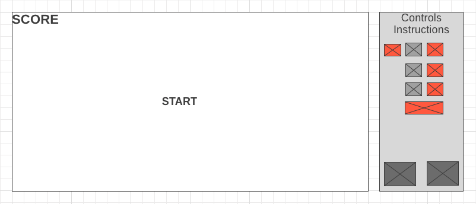

<h1>Bit Maximo!</h1>

Bit Maximo! is a simple game about a character jumping, sliding, and diving through obstacles. The more obstacles the player overcomes, the faster new obstacles generate. To up the challenge, the player must change the character's color depending on the color of the obstacle. If the player does not match the color of the obstacle or collides with an obstacle, the player loses. The character will jump with the up arrow, slide with the down arrow, and dive with the right arrow. The character will be able to cyle through blue(a key), red(s key), and green(d key) to match the obstacles.

As the game progresses, more obstacles will be generated and the game will speed up to add a level of difficulty for the player. The more obstacles the player goes through, the more points they accumulate. Although it's a simple game, it manages to test the player's dexterity along with their hand-eye coordination from switching between jump, slide, dive while alternating between blue, red, green. 

This game is inspired by another game I used to play as a kid on newgrounds.com (Thank you Tom Fulp!). 

<h2>Functionality & MVP</h2>

<ul>
    <li>Player can press "up", "down", "right arrow" keys to jump, slide, and dive.</li>
    <li>Player can press "a", "s", "d" keys to change the charatacter's color between blue, red, and green.</li>
    <li>Obstacles will be genereated on the right side of the screen and move towards the left of the screen while the character runs in place.</li>
    <li>A score will be kept at the the top left hand side of the screen.</li>
    <li>Start, pause, restart, and reset simulation</li>
    
</ul>

<h2>Wireframe</h2>

The app will consist of a single page with a start button. Instructions will be on the side of the main screen with keys along with images of the character's animation. 

Once the player presses the start button, the game will fade in with the character running. A few seconds in, the first obstacle will appear. After the first obstacle, the obstacles will pick up speed. After the 10th obstacle(or earlier), the obstacles will begin to change color.

As soon as the player hits the first obstacle, it will be "Game Over" (or might just be lenient and implement a life system so that the player is able to experience more of the game without having to start over). Another screen will appear with the "Game Over"; along with the high scores and the ability to either enter your high score or play again. 

A button will be included to toggle sound on/off. (The button will also be toggled by pressing the "m" key).

<h3>Technologies Used</h3>

<ul>
    <li>Vanilla JavaScript for game logic</li>
    <li><code>Webpack</code> for version control</li>
    <li><code>HTML5 Canvas</code> for DOM manipulation and rendering</li>
    <li><code>Web Audio API</code> for generating sound</li>
</ul>

In addition to the technologies listed above, this project will include the following files:

<ul>
    <li><code>game.js</code></li>
    <li><code>plane.js</code></li>
    <li><code>player.js</code></li>
    <li><code>obstacles.js</code></li>
    <li><code>collision.js</code></li>
    <li><code>scoreboard.js</code></li>
</ul>

<h2>Implementation Outline</h2>

<h3>Day 1</h3>
<ul>
    <li>Shop around for audio apis</li>
    <li>Shop around for sprites</li>
    <li>research how to make continuous scrolling screen</li>
    <li>Look at motion and audio tutorials</li>
</ul>

<h3>Day 2</h3>
<ul>
    <li>start building out the skeleton for the files</li>
    <li>get webpack serving files and frame out index.html</li>
    <li>start getting obstacles created</li>
</ul>
<h3>Day 3</h3>
<ul>
    <li>start creating the logic for the backend</li>
</ul>
<h3>Day 4</h3>
<ul>
    <li>incorporate sprites/models of character</li>
</ul>
<h3>Day 5</h3>
<ul>
    <li>create controls for game</li>
</ul>

<h2>Bonus Features</h2>

These are features that may be included in the near future:

<ul>
    <li>Breaking the game into multiple levels</li>
    <li>Intergrate 2 more colors</li>
    <li>Introduce a story mode</li>
</ul>
    